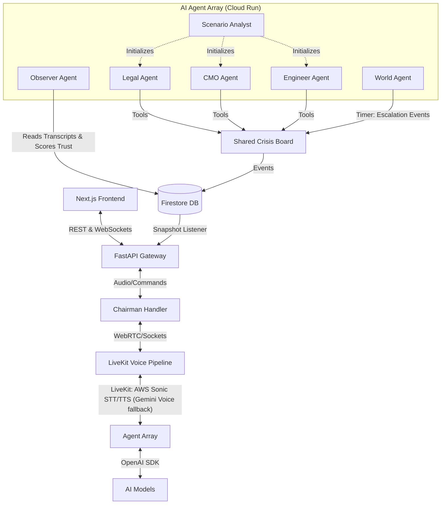
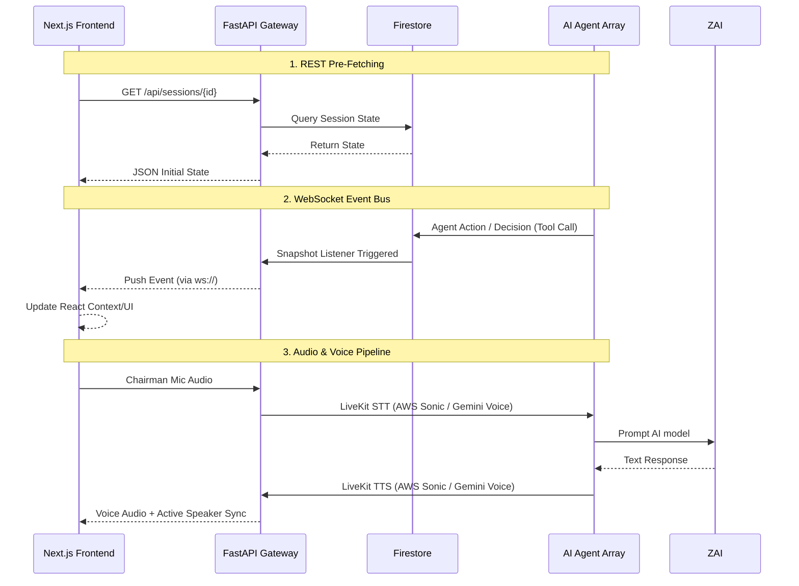
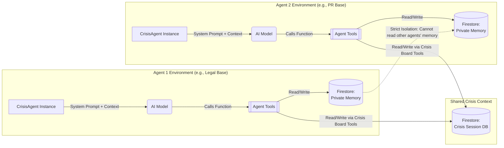

# WAR ROOM — AI Crisis Simulation Platform

**WAR ROOM** is an immersive, multi-agent AI crisis simulation platform. Users take on the role of the "Chairman" or "Director," navigating high-stakes, dynamically generated scenarios by orchestrating a team of specialized AI advisors.

This document outlines the holistic system architecture and the complex interactions between the Next.js frontend client and the robust AI-driven Python backend.

---

## 🏗️ High-Level Architecture Overview

The system is designed as a decoupled, real-time client-server application optimized for high-bandwidth, continuous state synchronization and raw audio streaming.

* **Frontend Client:** A highly responsive React/Next.js (App Router) Single Page Application styled with modern visuals and functional dashboards. Located in `./src`.
* **Backend Server:** A scalable, asynchronous Python FastAPI server orchestrating the AI lifecycle, maintaining state, and routing communications. Located in `./backend`.

### Core Interaction Paradigm



WAR ROOM relies heavily on **Event-Driven Architecture (EDA)** paired with **WebRTC and WebSockets** to maintain an immersive illusion of simultaneous agent presence. The backend acts as a single source of truth, generating state changes using autonomous background AI reasoning loops, which are then eagerly synced to the UI.

---

## 🤖 Meet Your AI Crisis Team (What the Agents Do)

WAR ROOM is powered by a team of specialized AI agents that act as your advisors during a crisis. Think of them as experts sitting around a table, waiting for your commands. Here is how they work together:

### 1. The Scenario Analyst (The Architect)

When you start a new session, the **Scenario Analyst** goes to work first. It acts like a casting director for the crisis. Based on the scenario, it decides exactly *which* experts need to be in the room.

For example, if there is a massive data breach, it might decide: "We need a Legal Expert to handle lawsuits, a Chief Marketing Officer (CMO) for public relations, and an Engineering Lead to fix the servers." It then automatically creates these specific "sub-agents," giving each one a unique name, a specific role, and special skills to help you navigate the crisis.

### 2. The Specialist Advisors (Your War Council)

These are the sub-agents created by the Scenario Analyst (like the Legal, PR, or Military agents). Each specialist acts independently:

* **They listen** to what you (the Chairman) say and what the other agents are discussing.
* **They think** about the crisis entirely from their professional point of view. For instance, the Legal agent will always worry about liability, while the PR agent will obsess over the company's public image.
* **They take action** by speaking up, debating with each other, suggesting solutions, or updating the shared "Crisis Board" to assist you.

### 3. The World Agent (The Game Master)

While you and your advisors are trying to solve the initial problem, the **World Agent** acts as the unpredictable outside world. It watches the clock and periodically injects new twists—like "Breaking News: The company's stock price just crashed" or "A new whistleblower has come forward." This keeps the pressure on and forces your team to constantly adapt.

### 4. The Observer Agent (The Scorekeeper)

The **Observer Agent** quietly watches the entire conversation from the background. It evaluates how well you and your team are handling the crisis. It scores metrics like "public trust" or "company stability" based on your decisions, making sure there are real consequences for how you manage the situation.

---

## 📡 Frontend-Backend Interaction & Data Flow

Communication between the frontend visualization layer and the backend entity-management layer is categorized into three distinct pipelines:

### 1. RESTful Pre-Fetching and State Hydration



**Mechanism:** Standard HTTP/JSON APIs (e.g., `GET /api/sessions/{session_id}`).

**Purpose:**
When the frontend first loads a view or when a user forcefully refreshes the page, the Next.js application queries the backend's REST Gateway to construct the initial UI.

* **Dashboard Population:** Fetching the scenario brief, agent rosters, crisis Intel, timeline escalations, and the current threat posture.
* **Session Management:** Sending initialization parameters to `POST /api/sessions` to instruct the Python bootstrapper to begin generating a scenario asynchronously.

### 2. The WebSocket Event Bus (The Nervous System)

**Mechanism:** Full-duplex WebSocket connections handled by `backend/gateway/connection_manager.py`.
**Purpose:**
Because crisis agents (e.g., Legal, PR, Military) and the "World Agent" act autonomously, the frontend cannot solely rely on polling.

* **Server-to-Client Push Events:** When an AI agent decides on a new policy, when the World Agent injects breaking news, or when the overall "Threat Level" changes, the backend broadcasts these events down the WebSocket.
* **UI Reactivity:** The frontend listens to these generic event payloads and dynamically updates React context, immediately rendering new crisis alerts, rendering agent thought-processes, and updating relationship/trust scores without a page reload.

### 3. The Audio & Voice Pipeline

**Mechanism:** WebSockets and LiveKit (WebRTC).
**Purpose:**
The most complex interaction layer, designed to handle bidirectional voice streams between the user and the AI array using the **LiveKit SDK** with **AWS Sonic** (primary) and **Gemini Voice** (fallback).

* **Client-to-Server:** The Next.js frontend captures the Chairman's microphone hardware, encodes the audio, and streams it via WebSocket directly to the `chairman_audio_ws.py` router on the backend.
* **Backend Transcription & Routing:** The backend receives the chunked audio, pipes it to AWS Sonic (or Gemini Voice fallback) for STT (Speech-to-Text) via LiveKit. The transcript is then sent to the AI model API for intent reasoning, determining *which* AI agent should react, and triggering their specific logic loop.
* **Server-to-Client Audio:** Once an agent determines their response, the text is synthesized into speech using AWS Sonic TTS (or Gemini Voice fallback). This generated audio is then piped back to the frontend via LiveKit rooms or direct binary WebSocket chunks.
* **Active Speaker Gating:** To prevent chaotic "voice leakage" where multiple AIs talk simultaneously, the architecture enforces strict turn-based speaking locks. The backend emits active-speaker tokens, ensuring the frontend's audio player drops chunk overlaps and mutes inactive components.

---

## 🧩 Architectural Breakdown

### The Frontend (Next.js)

* **`/src/app`:** Next.js Server Components acting as routing shells and fetching initial session context.
* **`/src/components`:** Heavy client-side interactive widgets (Dashboards, Map visualizations, Agent interaction panels). These components utilize custom hooks to maintain WebSocket connections and handle audio buffering.
* **Audio Player/Manager:** A specialized local AudioContext manager responsible for decoding base64 audio frames and sequentially playing AI responses while animating UI indicators.

### The Backend (FastAPI + AI Agents)

* **`/backend/main.py` & `/gateway`:** REST/WS controllers routing traffic into the simulation.
* **`/backend/agents`:** Isolated Python classes inheriting from a `BaseCrisisAgent`. Each agent maintains its own localized prompt memory and connects to the AI model via the OpenAI SDK independently to reason about incoming inputs.
* **State Store (Firestore/Mock Database):** The centralized ledger mapping the state of the session, agent decisions, and historical actions, allowing for immediate session recovery and performance observability.

The WAR ROOM application enforces a strictly isolated memory architecture for each agent, mitigating hallucinations and ensuring specialized domain focus.



---

## 🧪 Testing & Quality Assurance

WAR ROOM leverages **TestSprite AI** for comprehensive, agent-driven automated testing across its decoupled architecture, ensuring resilience in session state management and realtime streaming.

* **[Backend Test Reports](./backend/testsprite_tests/)**: Validates the FastAPI gateway, session bootstrapper, and AI memory isolation. (See the [Detailed Backend Report](./backend/testsprite_tests/testsprite-mcp-test-report.md)).
* **[Frontend Test Suite](./testsprite_tests/)**: Validates the React client's UI reactivity, WebSocket event parsing, and WebRTC streaming buffers.

Click the links above to navigate to the respective testing artifact directories.

---

## 🚀 Getting Started

To run the full stack locally for development:

### Prerequisites

* Node.js (v18+)
* Python 3.10+
* Requested API Keys (AI model, LiveKit) specified in `./backend/.env`

### Run the Backend

```bash
cd backend
python3 -m venv .venv
source .venv/bin/activate
pip install -r requirements.txt
python main.py
```

*The backend will boot on `http://localhost:8000`.*

### Run the Frontend

```bash
# In an adjacent terminal window
cd [project-root]
npm install
npm run dev
```

*The frontend will be accessible at `http://localhost:3000`.*